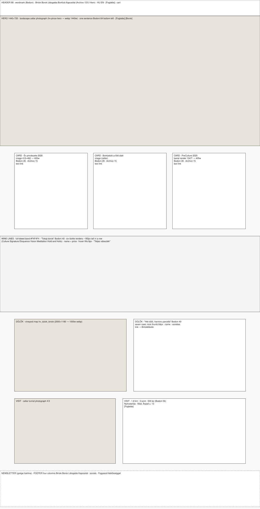
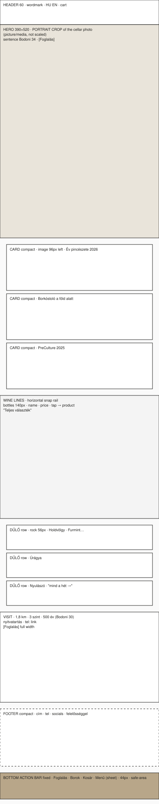

# Layout specifications — desktop 1440 and phone 390

**Status: approved 2026-09-16 (D13); the home page and every later page were built to
these frames.** Phase 1 of `00-plan.md`, started on the owner's "Go" (D10). Per D5
these are two designed experiences, not one layout reflowed. Each is specified at its
reference size; tablet is resolved as its own state at the end.

Gate 1 (the design system) was approved 2026-09-16 (D12). The two frames below are
composed from those approved components and the real assets at the exact reference
sizes; the box schematics further down fix the same thing in diagram form. The frames were approved and the home page built from them and measured
(`06-home-build.md`).

<figure><figcaption>Desktop · 1440 — <a href="frames/home-desktop-1440.html">open at full size</a></figcaption>
<iframe src="frames/home-desktop-1440.html" title="Desktop frame, 1440 wide" loading="lazy"></iframe>
</figure>
<figure><figcaption>Phone · 390 — <a href="frames/home-phone-390.html">open at full size</a></figcaption>
<iframe src="frames/home-phone-390.html" title="Phone frame, 390 wide" loading="lazy"></iframe>
</figure>

Two things the frames make visible that the boxes did not: the dűlő list needs
**two rock photographs the site does not have** (Úrágya, Kakasok — shown as marked
gaps, added to §6 of the plan), and the phone hero is a **provisional centre crop**
of the landscape frame until a portrait photograph is supplied.

## Shared rules

- Palette and type from `assets/tokens.css`: ground `#FAFAFA`, cards `#FFFFFF`,
  band `#F4F4F4`, ink `#1D1D1B`, the one accent `#B8A689`, hover `#8B705B`.
  Bodoni Moda for the sentence, the headings and the wordmark; Archivo at width
  112.5 for everything else. No other colour, no other face.
- Breakpoints: phone ≤ 767 (designed at 390), tablet 768–1023, desktop ≥ 1024
  (designed at 1440). Each breakpoint has its own navigation and its own image
  crops; nothing is "the desktop squeezed".
- Every hero is a photograph and one sentence. The sentences already exist:
  home "A tokaji álmot töltjük pohárba az élet nagy pillanataihoz"; tasting
  "Borkóstoló a föld alatt"; estate "A gondolatok bora".
- Bottles are transparent renders on the ground colour, never on a coloured panel.
- Hospitality CTA before shop CTA in every pair.
- One `h1` per page. 44 px minimum on every tap target on every device.
- Home weight budget 1,5 MB (the client's own acceptance target), measured at both
  reference sizes with the real assets in place.

## Desktop 1440 — the editorial estate

Grid: 12 columns, content max 1280, gutter 24, margins 80. Type: hero sentence
Bodoni 64, section headings Bodoni 40, card titles Bodoni 28, body Archivo 15,
labels Archivo 12 caps at 0.14 em tracking.

1. **Header, 88 px, sticky.** Wordmark HOLDVÖLGY (Bodoni, 22, tracked) left; the
   five items centred (D4); right: HU / EN, an outlined greige *Foglalás* button,
   the cart. *Borok* and *Látogatás* open a mega-panel on hover and on focus: Borok
   shows the six lines with a bottle thumbnail each and "Teljes választék";
   Látogatás shows the three programmes with duration and "Foglalás". No hamburger
   exists at this size.
2. **Hero, 1440 × 720.** The landscape cellar photograph (`hv-pince-hero.jpg`,
   served as WebP at 1440 w, AVIF where supported), a bottom-left gradient for
   legibility, the sentence in white, two buttons: *Foglalás* solid greige, *Borok*
   outlined white. Not viewport-height: the three cards are visible below the fold
   line on a 900-px-tall screen.
3. **Three cards, 3 × 405.** Év pincészete 2026 · Borkóstoló a föld alatt ·
   PreCulture 2025. Image on top (the illustrated `_birtok-413` cards are exactly
   this width; the PreCulture barrel render for the third), Bodoni 28 title, two
   lines of Archivo 15, a text link. Same edges, same baselines.
4. **Wine lines, full-bleed band `#F4F4F4`, 420 tall.** "Tokaji borok" Bodoni 40;
   six renders in a row at ~180 px tall — Culture, Signature, Eloquence, Vision,
   Meditation, Hold and Hollo — name and from-price beneath; hover lifts the bottle
   6 px; "Teljes választék" right-aligned. This is the Penfolds isolated-bottle grid
   on Holdvölgy's ground.
5. **Dűlők, two columns.** Left the vineyard map (`hv_dulok_birtok.png`, 2000 ×
   1180, served at 1000 w); right "Hét dűlő, harminc parcella" Bodoni 40 and seven
   rows, each a 64-px rock thumbnail, the dűlő name, its varieties. Rows link to the
   Birtok page anchors.
6. **Visit, two columns.** Left the cellar-tunnel photograph 4:3; right the three
   numbers 1,8 km · 3 szint · 500 év in Bodoni 56, opening hours, the address,
   *Foglalás*.
7. **Newsletter and footer.** A greige hairline, the newsletter line, four columns
   (Birtok · Borok · Látogatás · Kapcsolat), socials, "Fogyaszd felelősséggel".

## Phone 390 — the hospitality-and-buying tool

Margins 16, single column, type: hero sentence Bodoni 34, headings Bodoni 26,
body Archivo 15, labels 12. The page exists so someone can book or buy from the
car park at Mád in two taps.

1. **Header, 60 px.** Wordmark small, HU / EN, cart. **No hamburger in the
   header** — navigation lives in the bar at the bottom, under the thumb.
2. **Bottom action bar, 64 px, fixed, safe-area aware.** Foglalás · Borok · Kosár ·
   Menü. Each 44 px. *Menü* opens a sheet with the five items plus Tokaji aszú,
   Bortrezor, Ajándék, Experience. Every page has this bar; it is the phone's
   navigation system, not a collapsed desktop menu.
3. **Hero, 390 × 520, portrait crop.** A separately cropped portrait frame of the
   cellar photograph via `<picture>` and `media` — the desktop landscape is never
   scaled down. The sentence at Bodoni 34, one button *Foglalás* (Borok is in the
   bar).
4. **Three compact cards, stacked, 112 px each.** Image 96 px on the left, title
   and one line on the right. Three cards fit in 336 px, so the wine rail is
   reached in one scroll.
5. **Wine lines, horizontal snap rail.** Bottles 140 px, name and price; tap goes
   to the product. Rail, not grid: a buying tool shows the range and moves on.
6. **Dűlők, three rows shown, "mind a hét →".** Rock thumbnail 56 px, name,
   varieties. The full seven live on Birtok.
7. **Visit.** The three numbers in one row at Bodoni 30, hours, the phone number
   as a `tel:` link, *Foglalás* full-width.
8. **Footer, compact.** Address, phone, socials, responsibility line — no accordion,
   nothing collapsed.

## Tablet 768–1023 — resolved, not inherited

Desktop section order and two-column layouts; **phone navigation** (bottom bar and
sheet) because the mega-panel needs hover and horizontal room. Cards two-up with
the third full-width beneath; the bottle band four across with the remaining two
on a second row; map above the dűlő list; visit stacked. Hero uses the landscape
crop at 1024 w. Margins 40.

## Home weight budget, both sizes

| Asset | Desktop | Phone |
|---|---|---|
| Hero (WebP; AVIF where supported) | 1440 w ≈ 180 KB | 780 w portrait ≈ 90 KB |
| Six bottle renders → WebP with alpha, ≤ 360 px tall | ≈ 6 × 45 = 270 KB | ≈ 6 × 30 = 180 KB (rail, lazy beyond the third) |
| Vineyard map → WebP 1000 w | ≈ 120 KB | not loaded (rows only) |
| Seven rock thumbnails 128 px | ≈ 7 × 8 = 56 KB | 3 × 8 = 24 KB |
| Three card images | ≈ 90 KB | ≈ 45 KB |
| Fonts (two families, Latin-ext subset, swap) | ≈ 120 KB | ≈ 120 KB |
| HTML + CSS | ≈ 40 KB | ≈ 40 KB |
| **Total** | **≈ 880 KB** | **≈ 500 KB** |

Both under the 1,5 MB target with margin; measured, not estimated, once built.

## What is fetched for this phase (D7 lifted for the build)

From `holdvolgy.com/wp-content/uploads/`: `2024/04/hv-pince-hero.jpg` (521 KB),
`2024/04/hv_pincerendszer_pincealagut_lepcsovel_4-3.jpg` (101 KB),
`2024/07/hv_dulok_birtok.png` (180 KB), the seven `MVW_HV_kozet_*.png` rock files
(~1 MB each, converted to 128-px WebP and the originals discarded), six line renders
(`HV_Culture_3D_PALACK`, `HV_Signature_13`, `HV_Eloquence_14`, `HV_Vision_21`,
`HV_Meditation_23`, `HH_Dry`; ~290 KB each), `HV_preculture_hordo_2025.png`, two
`_birtok-413` cards, and `hv-megamenu-logo.svg`. Every file is listed with its
source URL in `docs/assets-used.md` when fetched; converted derivatives live in
`holdvolgy/assets/img/`, originals are not committed.
